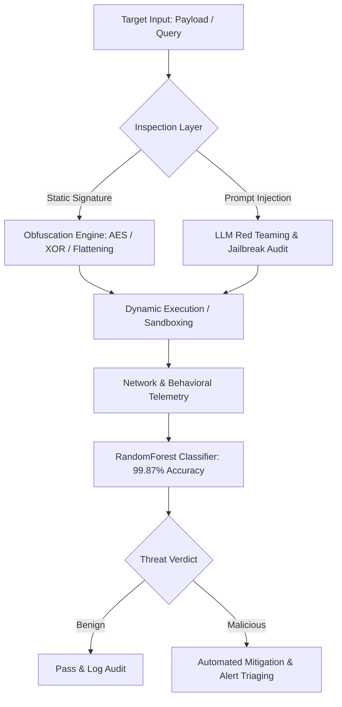
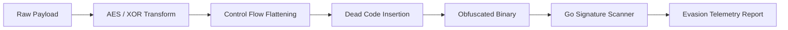

<div align="center">


<br/>

[](https://github.com/Ansh5008)

<br/>

<a href="mailto:anshkumar5008@gmail.com"></a>
<a href="https://github.com/Ansh5008"></a>
<a href="https://linkedin.com/in/ansh-kumar008"></a>
<a href="https://x.com/anshkumar5008"></a>
<a href="https://instagram.com/itz_classy20"></a>

<br/><br/>


&nbsp;
<a href="https://github.com/Ansh5008?tab=followers"></a>
&nbsp;

&nbsp;


<br/><br/>


</div>

---

<h1 align="center">> ACCESSING SECURITY OPERATIONS RECORD...</h1>

```text
================================================================================
                    GLOBAL THREAT & AI DEFENSE OPERATIONS
================================================================================

IDENTITY VERIFIED

OPERATOR        : Ansh Kumar
CALLSIGN        : Ansh5008
STATUS          : ACTIVE / DEPLOYED
CLEARANCE       : LEVEL-5 (RED TEAM & APPLIED ML RESEARCH)
ORGANIZATION    : AI-Twining-2024-2028
SPECIALIZATION  : Adversarial ML • Binary Exploitation • Threat Intelligence
LOCATION        : New Delhi, India

LOADING OFFENSIVE & DEFENSIVE MODULES...
[################################################################] 100%

SECURITY SUBSYSTEMS ARMED AND SYNCHRONIZED
================================================================================
```

<table width="100%">
<tr>
<td width="60%" align="center">
<div align="center">

<h2 align="center">ANSH KUMAR</h2>

**AI Security Researcher**, **CTF Competitor**, and **Machine Learning Engineer** operating at the crossroads of **offensive security**, **binary exploitation**, and **adversarial machine learning**.

Ranked **#21 Worldwide in the EC-Council Nexus AI Security CTF**, I engineer platforms that break, analyze, and harden intelligent systems: from designing multi-layer payload obfuscation pipelines and training real-time intrusion detection models to red-teaming LLMs against stateful jailbreaks.

*Rather than inspecting vulnerabilities in isolation, I construct resilient, end-to-end security architectures.*

</div>
</td>
<td width="40%" align="center">

```text
CURRENT DIRECTIVES

[OK] LLM Red Teaming & Jailbreaks
[OK] Adversarial Evasion Benchmarking
[OK] Binary Reversing & Pwn Chains
[OK] ML Intrusion Detection Systems
[OK] Automated Recon & Vuln Scanning
[OK] RAG Integrity & Prompt Auditing
[OK] CTF Applied Cryptanalysis
```

</td>
</tr>
</table>

---

<div align="center">
  
</div>

<h1 align="center">CLASSIFIED DOSSIER</h1>

<table width="100%">
<tr>
<td width="33%" align="center">

```yaml
PERSONNEL_ID:
  AK-5008
OPERATOR:
  Ansh Kumar
STATUS:
  Active / Operational
SPECIALIZATION:
  AI Security & Exploit Dev
CLEARANCE:
  Nexus Research
```

</td>
<td width="33%" align="center">

```yaml
AFFILIATIONS:
  AI-Twining-2024-2028
CTF_GLOBAL_RANK:
  #21 Worldwide
PRIMARY_OPS:
  - Adversarial ML
  - Binary Exploitation
  - Threat Modeling
LOCATION:
  New Delhi, India 🇮🇳
```

</td>
<td width="33%" align="center">

```yaml
CORE_RESEARCH:
  - LLM Red Teaming
  - Control Flow Flattening
  - Signature Evasion
  - Deep Learning IDS
  - State Reversing
  - Applied Cryptography
```

</td>
</tr>
</table>

---

<h1 align="center">OPERATIONAL READINESS</h1>

<table width="100%">
<tr>
<td align="center" width="33%">

<h3 align="center">Adversarial ML</h3>

```text
[################]
ONLINE • 98%
```

</td>
<td align="center" width="33%">

<h3 align="center">Binary Pwn & Reversing</h3>

```text
[################]
ONLINE • 96%
```

</td>
<td align="center" width="33%">

<h3 align="center">Threat Intelligence</h3>

```text
[###############-]
ONLINE • 92%
```

</td>
</tr>
<tr>
<td align="center" width="33%">

<h3 align="center">Vulnerability Assessment</h3>

```text
[################]
ONLINE • 97%
```

</td>
<td align="center" width="33%">

<h3 align="center">Network Security & IDS</h3>

```text
[################]
ONLINE • 99%
```

</td>
<td align="center" width="33%">

<h3 align="center">RAG Security Auditing</h3>

```text
[###############-]
ONLINE • 94%
```

</td>
</tr>
</table>

---

<h1 align="center">LIVE TELEMETRY</h1>

<table width="100%">
<tr>
<td width="25%" align="center">

<h2 align="center">CTF RANK</h2>

```text
#21
Worldwide
Nexus AI CTF
```

</td>
<td width="25%" align="center">

<h2 align="center">CODEBASES</h2>

```text
34+
Public Repos
Built & Deployed
```

</td>
<td width="25%" align="center">

<h2 align="center">ACCURACY</h2>

```text
99.87%
IDS Classifier
RF on CICIDS2017
```

</td>
<td width="25%" align="center">

<h2 align="center">STATUS</h2>

```text
ONLINE
24 / 7 / 365
Active Defense
```

</td>
</tr>
</table>

---

<h1 align="center">TECHNOLOGY ARSENAL</h1>

<div align="center">


<br/><br/>


</div>

<br/>

<table width="100%">
<tr>
<td width="25%" align="center">

<h3 align="center">LANGUAGES</h3>
- Python
- Golang
- C / Assembly
- Bash
- JavaScript / TypeScript

</td>
<td width="25%" align="center">

<h3 align="center">AI & RESEARCH</h3>
- PyTorch
- TensorFlow
- Scikit-Learn
- Hugging Face
- LLM Red Teaming / RAG

</td>
<td width="25%" align="center">

<h3 align="center">OFFENSIVE SECURITY</h3>
- GDB / Pwntools
- Radare2 / Ghidra
- Burp Suite Pro
- Nmap / Masscan
- Payload Obfuscation

</td>
<td width="25%" align="center">

<h3 align="center">DEFENSIVE & SOC</h3>
- CyberShield IDS
- Wireshark / TShark
- Suricata / Snort
- CICIDS2017 Datasets
- MITRE ATT&CK Framework

</td>
</tr>
<tr>
<td width="25%" align="center">

<h3 align="center">BACKEND & APIS</h3>
- FastAPI
- Flask
- Node.js
- REST / WebSockets
- Supabase / SQL

</td>
<td width="25%" align="center">

<h3 align="center">WEB & INTERFACES</h3>
- React
- Streamlit
- TailwindCSS
- HTML5 / CSS3
- Next.js

</td>
<td width="25%" align="center">

<h3 align="center">DATA & TELEMETRY</h3>
- Pandas
- NumPy
- Matplotlib / Seaborn
- Network Graphs
- OpenStreetMap / GIS

</td>
<td width="25%" align="center">

<h3 align="center">DEVOPS & ENV</h3>
- Linux (Kali / Arch / Ubuntu)
- Docker
- GitHub Actions CI/CD
- Git Version Control
- VS Code / Neovim

</td>
</tr>
</table>

---

<h1 align="center">CYBERSECURITY TOOLKIT</h1>

<table width="100%">
<tr>
<td align="center" width="25%">

<h3 align="center">Reconnaissance</h3>

```text
vulnscope
Nmap
Masscan
Wireshark
OSINT Dorks
```

</td>
<td align="center" width="25%">

<h3 align="center">Exploitation & Pwn</h3>

```text
pwntools
GDB-GEF
Burp Suite
Payload-Engine
ROP Chains
```

</td>
<td align="center" width="25%">

<h3 align="center">Reverse Engineering</h3>

```text
Ghidra
Radare2
IDA Free
Objdump
Control-Flow-Map
```

</td>
<td align="center" width="25%">

<h3 align="center">AI Security & Defense</h3>

```text
HackLLM / Waghnakhs
CyberShield IDS
RAG Audit Engine
Model Inversion Tests
Adversarial Perturb
```

</td>
</tr>
</table>

---

<h1 align="center">COMMAND CENTER</h1>

<table width="100%">
<tr>
<td width="33%" align="center">

<h3 align="center">ACTIVE OPERATIONS</h3>

```text
OBFUSCATION ENGINE
[################]
OPERATIONAL
------------------
CYBERSHIELD IDS
[################]
DEPLOYED
------------------
VULNSCOPE CLI
[################]
OPERATIONAL
------------------
RAG AUDIT AUTHORITY
[##############--]
ACTIVE AUDIT
```

</td>
<td width="34%" align="center">

<h3 align="center">SYSTEM HEALTH</h3>

```text
ML Inference Engines
99.2%
------------------
Evasion Benchmarks
96.8%
------------------
Packet Processing
100.0%
------------------
Red-Team Pipelines
97.5%
```

</td>
<td width="33%" align="center">

<h3 align="center">DEFENSE READINESS</h3>

```text
Adversarial ML
ACTIVE
------------------
Binary Hardening
ARMED
------------------
Realtime Telemetry
SYNCHRONIZED
------------------
Intrusion Detection
PROTECTED
```

</td>
</tr>
</table>

---

<h1 align="center">ADVERSARIAL ATTACK & DEFENSE WORKFLOW</h1>



---

<div align="center">
  
</div>

<h1 align="center">ACTIVE OPERATIONS SPOTLIGHT</h1>

<div align="center">

*"The quieter you become, the more you are able to hear. The deeper you probe, the more resilient the system."*

</div>

---

<h2 align="center">OPERATION 01: PAYLOAD-OBFUSCATION-ENGINE</h2>

```text
CLASSIFICATION  : RESTRICTED // OFFENSIVE RESEARCH
STATUS          : OPERATIONAL
TYPE            : Multi-Layered Evasion Pipeline & Signature Scanner
PRIMARY TECH    : Golang • Cryptography • Control Flow Flattening
MISSION         : Benchmark Static Signature Evasion Against Behavioral Analysis
```

A specialized red-team framework and pure-Go signature scanner built to evaluate detection engineering capabilities against obfuscated payloads.

**Operational Highlights:**
- **Customizable Transformation Pipelines**: Multi-pass encoding using AES-GCM, polymorphic XOR, and dead code injection.
- **Control Flow Flattening**: Obfuscates control logic to defeat disassemblers and static heuristics.
- **Pure-Go Signature Scanner**: Fast, zero-dependency pattern scanner to test payload detection prior to deployment.
- **Detection Benchmark**: Directly compares how heuristic AV engines respond to static mutations versus execution behavior.



<div align="center">
  <a href="https://github.com/Ansh5008/Payload-Obfuscation-Engine">
    
  </a>
</div>

---

<h2 align="center">OPERATION 02: CYBERSHIELD IDS (Smart_IntrusionDetectionSystem)</h2>

```text
CLASSIFICATION  : DEFENSIVE INTELLIGENCE
STATUS          : DEPLOYED & OPERATIONAL
TYPE            : ML-Powered Network Intrusion Detection System
ARCHITECTURE    : Python • Streamlit • Scikit-Learn • Supabase • Scapy
PERFORMANCE     : 99.87% Detection Accuracy on CICIDS2017 Dataset
```

An enterprise-grade, machine-learning-powered network intrusion detection platform built to detect, classify, and mitigate cyber attacks in real time.

**Operational Highlights:**
- **High-Precision ML Classification**: Trained on the comprehensive CICIDS2017 benchmark dataset, yielding **99.87% detection accuracy** using a tuned Random Forest model.
- **Live Packet Capture & Simulation**: Real-time packet parsing with automated payload classification and attack simulation.
- **Interactive Security Operations UI**: Interactive telemetry graphs, threat alerts, and authenticated investigator access.
- **Threat Vector Coverage**: Detects DDoS, PortScan, Infiltration, Web Attacks, and Brute Force attempts.


<div align="center">
  <a href="https://github.com/Ansh5008/Smart_IntrusionDetectionSystem">
    
  </a>
</div>

---

<h2 align="center">OPERATION 03: VULNSCOPE</h2>

```text
CLASSIFICATION  : RECONNAISSANCE & AUDITING
STATUS          : OPERATIONAL
TYPE            : High-Speed Modular Vulnerability Assessment CLI
PRIMARY TECH    : Python • Socket Programming • Concurrency • HTTP Heuristics
MISSION         : Automated Attack Surface Discovery & Port Enumeration
```

A modular CLI security utility engineered for fast reconnaissance, targeted port scanning, directory fuzzing, and vulnerability surface mapping.

**Operational Highlights:**
- **Concurrent Scanning Engine**: Multi-threaded socket scans that rapidly fingerprint open ports and exposed services.
- **Directory & Asset Enumeration**: Discovers exposed endpoints, misconfigured sensitive files, and default administration routes.
- **Modular Plugin Architecture**: Easily extensible with specialized assessment checks and output formats.

<div align="center">
  <a href="https://github.com/Ansh5008/vulnscope">
    
  </a>
</div>

---

<h2 align="center">OPERATION 04: AI SECURITY & LLM RED TEAMING</h2>

<table width="100%">
<tr>
<td width="50%" align="center">

<h3 align="center">WAGHNAKHS — HACK-LLM</h3>

```text
STATUS      : ACTIVE RESEARCH
CATEGORY    : LLM Jailbreak & Adversarial AI
MISSION     : Prompt Injection & Red Teaming
```

Adversarial exploration of large language model vulnerabilities, developing prompt injection matrices, jailbreak vectors, and model boundary probing techniques.

[Explore Repository](https://github.com/Ansh5008/Waghnakhs---HackLLM)

</td>
<td width="50%" align="center">

<h3 align="center">RAG RETRIEVAL AUDIT</h3>

```text
STATUS      : OPERATIONAL
CATEGORY    : Retrieval Integrity Defense
MISSION     : Auditing RAG Context Integrity
```

Tooling designed to inspect, audit, and benchmark retrieval augmented generation pipelines against adversarial poisonings, hallucinations, and source tampering.

[Explore Repository](https://github.com/Ansh5008/rag_retrieval_audit)

</td>
</tr>
</table>

---

<h1 align="center">SYSTEM DESIGN PRINCIPLES</h1>

<table width="100%">
<tr>
<td width="33%" align="center">

<h3 align="center">Zero Trust & Adversarial</h3>
Assume breach at every boundary. Design systems capable of operating under active adversarial manipulation and deceptive inputs.

</td>
<td width="33%" align="center">

<h3 align="center">Evidence-Grounded ML</h3>
Never trust a black-box model without empirical metrics. Validate models against adversarial perturbations and rigorous confusion matrices.

</td>
<td width="33%" align="center">

<h3 align="center">High-Velocity Tooling</h3>
Build CLI tools and services with concurrent execution, minimal runtime overhead, and clean, modular interfaces.

</td>
</tr>
</table>

---

<h1 align="center">CTF & COMPETITIVE TRACK RECORD</h1>

<table width="100%">
<tr>
<td width="33%" align="center">

<h2 align="center">🏆 #21 WORLDWIDE</h2>
<h3 align="center">EC-Council Nexus AI CTF</h3>
Global competition evaluating AI security, adversarial defense, and machine learning exploitation.

</td>
<td width="33%" align="center">

<h2 align="center">⚡ OFFENSIVE CTF</h2>
<h3 align="center">Pwn & Reversing</h3>
Stateful binary reversing, sandbox escapes, setuid privilege escalation, and ROP chain crafting.

</td>
<td width="33%" align="center">

<h2 align="center">🔐 APPLIED CRYPTO</h2>
<h3 align="center">Cryptanalysis</h3>
Classical and applied cryptanalysis, PRNG predictability, side-channel attacks, and key-recovery.

</td>
</tr>
</table>

---

<div align="center">
  
</div>

<h1 align="center">LIVE GITHUB ANALYTICS</h1>

<div align="center">
  
  
  <br/><br/>
  
  &nbsp;
  
</div>

<br/>

<h2 align="center">CONTRIBUTION ACTIVITY STREAM</h2>

<div align="center">
  
</div>

<br/>

<h2 align="center">CYBERNETIC CONTRIBUTION SNAKE</h2>

<div align="center">
  <picture>
    <source media="(prefers-color-scheme: dark)" srcset="https://raw.githubusercontent.com/Ansh5008/Ansh5008/output/github-snake-dark.svg"/>
    <source media="(prefers-color-scheme: light)" srcset="https://raw.githubusercontent.com/Ansh5008/Ansh5008/output/github-snake.svg"/>
    
  </picture>
</div>

---

<h1 align="center">SECURE TERMINAL SESSION</h1>

```bash
$ whoami
Ansh Kumar [Ansh5008]

$ role --clearance
AI Security Researcher & Offensive ML Engineer [Nexus Clearance]

$ cat active_mission.txt
Developing systems that evaluate, compromise, and reinforce
the security boundary of machine learning models and modern software.

$ status --telemetry
All nodes operational. 34 repositories synced. 0 critical breaches.
SYSTEM STATUS: ARMED & DEFENDED.
```

---

<h1 align="center">COMMUNICATION CHANNELS</h1>

<div align="center">

[](mailto:anshkumar5008@gmail.com)
[](https://linkedin.com/in/ansh-kumar008)
[](https://github.com/Ansh5008)
[](https://x.com/anshkumar5008)
[](https://instagram.com/itz_classy20)

</div>

<br/>

<div align="center">

```text
================================================================================
          IDENTIFY  ──►  PROBE  ──►  DECONSTRUCT  ──►  FORTIFY
================================================================================
```

<h3 align="center"><i>"The quieter you become, the more you are able to hear."</i></h3>

<br/>


</div>